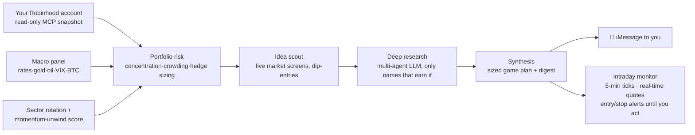

# 📈 Vibe Trading

**Your personal AI trading desk.** Every trading day it analyzes the market and *your real
Robinhood portfolio*, deep-researches the names that matter, and texts you a clear,
directly-placeable game plan — sized in dollars and shares against your actual cash.
An intraday monitor then watches prices with broker real-time quotes and pings you
(re-alerting until you act) when an entry, stop, or risk level is hit.

> ⚠️ **Disclaimer:** This is a personal, educational project — **not investment advice**.
> Trading involves risk of loss. Leveraged/inverse ETFs can lose value rapidly. The
> optional auto-trader places **real orders** when enabled. Use entirely at your own risk.

A sample morning digest on your phone:

```
📊 DESK · Wed Jul 8 · PREOPEN
🟢 Risk On Trend · target net 90%
🟢 Unwind risk: LOW (10.0)
🌎 Mkt: SPY -0.3% · QQQ +0.3% · lagging XLU, XLC
💼 Account $12,671 · holdings $9,975 · cash $2,696 (Robinhood real-time)

🟠 TRIM
• MU $164 ≈0.17股 · at the open, into strength
   • 持有0.52股≈$492@$941 · stop $920 · conv medium
   ↳ margin compression thesis — take profits into strength

🔎 New ideas: ARM(dip·diversifier), CRWD(dip·diversifier)
🛡️ Hedge ~10% ($997): PSQ ~$997 · standing insurance
⚠️ Concentration — 68% of the book is one AI-semis bet
```

## What's inside

| Subsystem | What it does | Risk |
|---|---|---|
| **`bot/desk/` — the advisory desk** (the main tool) | Reads your real account (read-only), researches, and **advises**. You place every trade yourself. | Has **no order tools** — it cannot trade, ever. |
| **`bot/` — the auto-trader** (optional, off by default) | A four-tier autonomous trader for a separate account. | Places **real orders** when scheduled with `PAPER_MODE=0`. Off unless you explicitly install it. |
| **`TradingAgents/`** | Vendored multi-agent research framework by [Tauric Research](https://github.com/TauricResearch/TradingAgents) (Apache-2.0, unmodified). | Library only. |

### How the desk works (every trading day)



- **Pre-open (~8:00)** — full desk note: market pulse (why it's moving, web-searched),
  your account totals, per-name KEEP/BUY/TRIM/SELL calls with entry/stop/target/shares,
  a sized downside hedge, new ideas (entry-quality + diversification tagged), and a
  numbered game plan capped by your actual cash.
- **Intraday (9:30–16:00)** — a monitor re-snapshots your account (~every 15 min, so it
  *knows when you traded*), watches plan levels with broker real-time quotes, and
  re-alerts every 90 min while an actionable condition persists. Holding a -3x inverse
  ETF switches it to a 60-second tight watch with a hard-stop alert.
- **After close (~16:30)** — wrap note + accountability (every call is journaled and
  scored honestly, one episode per decision).
- **Sunday** — deep research refresh of the whole book.

### Safety model (the part to trust)

- The **desk cannot trade**: its only subprocesses are *read-only* `claude -p` relays
  (account snapshot, quotes, text polish) whose tool allowlists contain no order tools.
- The **auto-trader's LLM never authors orders**: a pure, fully-unit-tested
  `guardrails.py` is the only component that can create an order, under hard caps
  (position %, hold class, day-trade/PDT budget, cash buffer). An `bot/logs/ALERT`
  file halts everything until a human removes it.
- **246 unit tests**, all offline.

---

## Prerequisites

1. **macOS** — scheduling uses `launchd`; alerts use iMessage/Notification Center
   (AppleScript). Linux users can run the Python entry points manually/cron but
   alerts + scheduling are macOS-only today.
2. **Python 3.10+**
3. **[Claude Code](https://claude.com/claude-code) CLI**, installed and logged in
   (`claude` must work in your terminal). The desk uses it for read-only account
   snapshots and text enrichment — your Claude subscription covers it.
4. **The `robinhood-trading` MCP server** connected in Claude Code and authenticated
   to your Robinhood login. In Claude Code run `/mcp` to check; add it per Robinhood's
   agentic-access instructions (agent.robinhood.com), then authenticate when prompted.
   Verify with: ask Claude Code *"list my accounts"* — you should see your account numbers.
5. **An OpenRouter API key** (recommended, ~$1–2/day) — or an Anthropic API key if you
   prefer Claude models for research (higher quality, ~3× cost).
6. *(Optional)* **Google Chrome** — only for rendering image versions of reports.

## Quick start

```bash
git clone https://github.com/Rickyzhaoweihan/Vibe_trading.git
cd Vibe_trading

# 1. environment
python3.10 -m venv .venv
.venv/bin/pip install -r requirements.txt

# 2. configuration
cp .env.example .env
$EDITOR .env          # fill in DESK_ACCOUNT + OPENROUTER_API_KEY at minimum

# 3. smoke test (no LLM cost, no messages sent)
.venv/bin/python bot/desk/desk.py --mode preopen --no-research --no-notify

# 4. first real pass: deep-research your whole book (~10 min/name, runs in parallel)
.venv/bin/python bot/desk/desk.py --mode bootstrap

# 5. run the full unit test suite any time
.venv/bin/python -m unittest discover -s bot/tests -p 'test_*.py'
```

If step 3 prints a digest ending in your holdings, you're wired up. If it warns
`POSITIONS: ...`, the account snapshot hasn't run yet — check the MCP connection
(prerequisite 4) and your `DESK_ACCOUNT`.

## Adapting it to YOUR account

Everything personal lives in `.env` (gitignored) — the code contains no account data.

| Variable | Required? | What it is |
|---|---|---|
| `DESK_ACCOUNT` | **yes** | Your Robinhood account number the desk analyzes (read-only). Find it: ask Claude Code "list my accounts", or Robinhood app → Account → Investing. |
| `OPENROUTER_API_KEY` | **yes**\* | Powers deep research (GLM 5.2, ~$0.20/researched name). \*Or set `BOT_LLM_PROVIDER=anthropic` + `ANTHROPIC_API_KEY`. |
| `ALERT_IMESSAGE` / `ALERT_EMAIL` | recommended | Where digests and intraday alerts go (your own phone/email). |
| `DESK_LANG` | no | `en` (default) or `zh` — delivery language of notes. |
| `BOT_ACCOUNT`, `PAPER_MODE`, `ANTHROPIC_API_KEY` | auto-trader only | See "The optional auto-trader" below. |

Cost/risk knobs (`DESK_RESEARCH_*`, `DESK_BASE_HEDGE`, `DESK_DEFAULT_STOP_PCT`, …) are all
documented inline in [`.env.example`](.env.example).

Beyond `.env`, three files carry *example* market opinions you may want to edit:

- **`bot/desk/conf.py`** — `HOLDINGS` (offline fallback only — the live snapshot
  overrides it automatically), `CLUSTERS` (which "bet" each ticker belongs to, used for
  concentration/crowding warnings), `SCOUT_POOL` (curated idea universe; a live market
  screen adds fresh names on top), hedge instruments and thresholds.
- **`bot/universe.json`** — example core watchlist for the (optional) weekly auto-trader research.
- Alert thresholds (`ALERT`, `UNWIND` in `conf.py`) — sensible defaults; tune to taste.

Your live positions, cash, plans, logs, and reports are written locally and are all
**gitignored** — nothing personal can end up in a commit.

## Schedule it (run automatically every trading day)

```bash
bot/launchd/install_schedule.sh --dry-run   # see what would be installed
bot/launchd/install_schedule.sh             # install + load the 5 desk jobs
```

| Job | Local time* | What it does |
|---|---|---|
| `desk.preopen` | 08:00 | Full note + game plan + the day's plan file |
| `desk.monitor` | 09:25 | Intraday alert loop (self-terminates at close) |
| `desk.wrap` | 16:30 | After-close note + accountability review |
| `desk.weekly` | Sun 10:00 | Whole-book research refresh |
| `desk.watchdog` | 09:15 | Alerts you if the preopen note never arrived |

\* launchd fires on your machine's **local clock**; the shipped times assume US-Eastern.
On another timezone, edit the times in `bot/launchd/templates/` before installing.
`--uninstall` removes exactly what the installer added, nothing else.

## What it costs

- **Research LLM**: with the default GLM 5.2 via OpenRouter, research is *selective* —
  only names with a catalyst/move/your-trade/staleness earn a deep run — roughly
  **$1–2/trading day** (~$40–50/mo). Anthropic models: ~3× that. Knobs:
  `DESK_RESEARCH_MIN_SCORE`, `DESK_RESEARCH_MAX`.
- **Claude Code relays** (snapshots/quotes/enrichment): covered by your Claude subscription.
- **Market data**: free (yfinance + your broker's real-time quotes via MCP).

## The optional auto-trader (`bot/`) — off by default

A separate, fully autonomous system (regime classifier → pure strategy policies → LLM
router → `guardrails.py` order author → reconciler) intended for a small dedicated
account. It is **not installed** by the default scheduler. If you want it:

1. Read `CLAUDE.md`'s architecture + trust-boundary sections first.
2. Set `BOT_ACCOUNT`, `ANTHROPIC_API_KEY`, and keep **`PAPER_MODE=1`** until you've
   watched it behave.
3. `bot/launchd/install_schedule.sh --with-autotrader`

**`PAPER_MODE=0` places real orders with real money. Do not enable it casually.**

## Acknowledgments

Deep per-ticker research is powered by **[TradingAgents](https://github.com/TauricResearch/TradingAgents)**
by Tauric Research — a multi-agent LLM financial trading framework. It is vendored
**unmodified** in [`TradingAgents/`](TradingAgents/) (upstream commit `04f434e`, v0.2.5 line)
under its own **Apache-2.0** license ([`TradingAgents/LICENSE`](TradingAgents/LICENSE),
provenance in [`TradingAgents/VENDORED.md`](TradingAgents/VENDORED.md)). Huge thanks to
the authors — please cite them:

```bibtex
@misc{xiao2025tradingagentsmultiagentsllmfinancial,
      title={TradingAgents: Multi-Agents LLM Financial Trading Framework},
      author={Yijia Xiao and Edward Sun and Di Luo and Wei Wang},
      year={2025},
      eprint={2412.20138},
      archivePrefix={arXiv},
      primaryClass={q-fin.TR},
      url={https://arxiv.org/abs/2412.20138},
}
```

Built with [Claude Code](https://claude.com/claude-code) and the `robinhood-trading` MCP server.

## License

[MIT](LICENSE) for this project's own code. The vendored `TradingAgents/` directory
remains **Apache-2.0** (© Tauric Research). See [LICENSE](LICENSE) for the full text
and carve-out.

**Not investment advice. Nothing here is a recommendation to buy or sell any security.
Past performance of any strategy in this repo does not indicate future results.**
